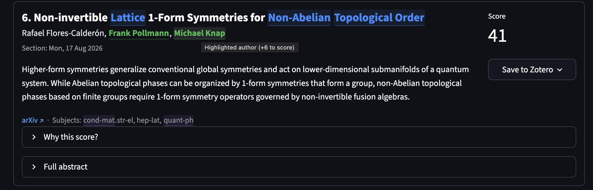

# arXiv digest

[](https://github.com/isaac-tes/arxiv-digest/actions/workflows/ci.yml)
[](https://github.com/isaac-tes/arxiv-digest/releases)
[](https://github.com/isaac-tes/arxiv-digest/blob/main/LICENSE)
[](https://www.python.org/downloads/)

<p align="center">
  
  <br>
  <em>Matched keywords and authors highlighted, a live score breakdown, one-click Save to Zotero.</em>
</p>

Fetches arXiv listing pages for **any** category, scores papers by your keyword / author / subject preferences, and presents the ranked digest as a **web app** (`arxiv-gui`) for interactive browsing and tuning, or as a CLI report (terminal, Markdown, JSON) for automation. Works with any arXiv feed (`hep-th`, `cs.LG`, `math.AG`, …); the defaults just ship a condensed-matter / quantum-physics set you can replace.

**👋 Most people should use the web app.** It runs in your browser, shows each paper's keyword / author / subject hits highlighted in color, explains *why* it scored what it did, and offers one-click **Save to Zotero**. The CLI is there for those who want a scriptable, terminal-first digest sharing the exact same preferences and config.

Both share the same `Config` and `arxiv_config.json`; tweak in one, the other picks it up.

📚 **Docs**: <https://isaac-tes.github.io/arxiv-digest/> (live once the repo is public).

## Defaults

- **Feeds**: any arXiv listing works; ships defaulting to `cond-mat`, `cond-mat.mes-hall`, `cond-mat.quant-gas`, `quant-ph` (edit in the Feeds tab or `arxiv_config.json`)
- **Timeframe**: `pastweek` (last ~5 days)
- **Top N**: 20
- **Output**: stdout

### Starter presets

Three built-in, read-only topic bundles (keywords + authors + feeds) give you a starting point instead of the generic default:

| Preset | Focus |
|--------|-------|
| `open-quantum-systems` | Lindbladian dynamics, dissipation, driven-dissipative & non-Markovian systems |
| `quantum-many-body` | Thermalization, many-body localization, tensor networks, strongly correlated systems |
| `floquet-topological` | Floquet engineering, periodically driven systems & topological matter |

Pick one in the GUI **Profiles → Starter presets** (**Load** replaces your working config, **Add** merges it in) or on the CLI with `--preset NAME` / `--add-preset NAME` (see `--list-presets`). Presets never overwrite your saved profiles or `arxiv_config.json`; they only change the in-memory config until you explicitly save. Topic sets are editable starting points; edit freely.

---

## 🖥️ Start with the web app (recommended)

Three steps: install `uv`, install the app, run `arxiv-gui`. Your browser opens with the ranked digest and you can start tuning right away.

### 1. Install uv

<details>
<summary><b>Only if you don't have <code>uv</code> yet</b> — install it on your OS (one command), then come back</summary>

`uv` is a fast, single-binary Python package manager. Official install scripts:

- **macOS / Linux (curl)**
  ```bash
  curl -LsSf https://astral.sh/uv/install.sh | sh
  ```
- **Windows (PowerShell)**
  ```powershell
  powershell -ExecutionPolicy ByPass -c "irm https://astral.sh/uv/install.ps1 | iex"
  ```
- **Homebrew (macOS / Linux)**
  ```bash
  brew install uv
  ```

Then restart your terminal (so the `uv` command is on your `PATH`) and verify with `uv --version`. See the official [uv install docs](https://docs.astral.sh/uv/getting-started/installation/).

</details>

Already have `uv`? Skip straight to step 2.

### 2. Get the app

```bash
git clone <repo-url> arxiv-digest
cd arxiv-digest
uv tool install '.[gui]'      # installs the arxiv-gui web app on your PATH
```

> `.[gui]` pulls in the web app's dependencies (Streamlit + pandas). If you only
> ever use the CLI, omit the `[gui]` extra: `uv tool install .`.

### 3. Run the web app

```bash
arxiv-gui
```

Your browser opens `http://localhost:8501`. Feeds default to a condensed-matter /
quantum-physics set — hit **Fetch papers** in the sidebar and start reading. Pick
a [starter preset](#starter-presets) if you'd rather start from a prepared topic
bundle.

**Prefer not to install?** `uvx` runs the web app on the fly with nothing to
uninstall:

```bash
uvx --from '.[gui]' arxiv-gui     # from inside the clone
```

### Install as a tool on your PATH (CLI + GUI)

```bash
uv tool install '.[gui]'           # from inside a clone
arxiv-digest --top 10              # CLI command, anywhere
arxiv-gui                          # launches the web app

uv tool uninstall arxiv-digest     # remove
```

Python 3.12 or newer is required; `uv` installs it for you if it's missing.

### Run without installing (uvx)

`uvx` runs the package on the fly from your clone, with no `uv tool install`, no
PATH entry, and nothing to uninstall:

```bash
uvx --from '.[gui]' arxiv-digest --top 10   # CLI, anywhere in the clone
uvx --from '.[gui]' arxiv-gui               # web app — opens your browser
```

`uvx` builds the package from the current directory each time, so it always
picks up your latest edits (no `--reinstall` needed). It's the lightest way to
try the tool or run it from a fresh clone. The `[gui]` extra pulls in Streamlit
+ pandas; drop it for CLI-only runs (`uvx --from . arxiv-digest --top 10`).

### Updating to the latest version

One command, from inside your clone:

```bash
./scripts/update.sh
```

It pulls the newest code and rebuilds the installed tools. Equivalent manual steps:

```bash
cd arxiv-digest
git pull                               # newest code (or: git fetch && git checkout v0.3.0 for a tag)
uv tool install '.[gui]' --reinstall   # rebuild the arxiv-digest / arxiv-gui tools
```

> **Why `--reinstall`?** `uv tool` installs into an isolated environment that does **not** auto-track your clone, so `git pull` alone won't update the `arxiv-digest` / `arxiv-gui` commands. The reinstall rebuilds them. (If you `uv run` from the clone instead of installing as a tool, just `git pull` is enough.)

---

## GUI guide

### Launching

The quickest way to open it is the installed `arxiv-gui` command:

```bash
arxiv-gui                            # opens http://localhost:8501 in your browser
```

Or, running straight from a clone (after `uv sync --group gui`):

```bash
uv sync --group gui                  # one-time, installs Streamlit + pandas
uv run streamlit run arxiv_gui.py    # opens http://localhost:8501 in your browser
```

The GUI opens `http://localhost:8501` in your browser automatically. The first time you launch, the app loads `arxiv_config.json` if present in the project root, otherwise the built-in defaults. Profiles you save go to `~/.arxiv_scraper/profiles/` and persist across sessions / project clones.

### The daily flow

1. **Sidebar**: pick **Timeframe** (`today` or `pastweek`), **Top N**, and which **Feeds** to fetch from. Click **Fetch papers**. The fetch is cached for 1 hour per `(timeframe, feeds)` combo, so re-clicking is instant; use **Clear fetch cache** to force a refresh.
2. **Papers tab**: papers appear ranked. Open *Why this score?* under any paper to see exactly which keywords / authors / subjects contributed. Open *Full abstract* to read more without leaving the page.
3. **Tweak preferences** in the **Keywords**, **Authors**, **Low priority**, **Scoring** tabs. The Papers tab re-ranks live on the cached fetch, with no re-fetch needed.
4. **Download** the current ranked list as Markdown or JSON via the buttons above the search box. The output format is byte-identical to `--output-markdown` / `--output-json`, so existing pipelines keep working.

### Tabs in detail

- **Papers**: ranked list, search box (filters by title / authors / abstract substring), MD + JSON download buttons. Per paper: rank, title, authors, section, summary, arXiv link, score badge, expandable score breakdown, expandable full abstract.
- **Keywords**: spreadsheet-style editor for `core_keywords`. Add/remove rows, click *Save core keywords*. *Reset to defaults* restores the built-in list. Each match adds the *Per-keyword bonus* (default +6) to a paper's score.
- **Authors**: same pattern for `named_authors`. Default +6 per match. Match is case-insensitive substring on author string.
- **Low priority**: penalty list. If *any* term matches, the paper takes the *Low-priority penalty* (default −5), once, not per hit.
- **Feeds**: `name → URL` editor. Add custom arXiv lists (e.g. `hep-th=https://arxiv.org/list/hep-th/new`). The `/new` / `/pastweek` suffix is rewritten by the timeframe selector at fetch time, so you can paste any base URL.
- **Scoring**: a **Whole-word matching** toggle (default on; untick for legacy substring matching), then number inputs for each weight: per-keyword bonus, per-author bonus, low-priority penalty, long-abstract bonus, the abstract-length threshold, and a **per-feed subject bonus** for every configured feed (subject scoring is driven by `feed_weights`; defaults `cond-mat.quant-gas` +4, `cond-mat.mes-hall` +4, `quant-ph` +2). *Apply weights* makes the change live; *Reset to defaults* puts it back.
- **Profiles**: **Starter presets** at the top: pick a built-in bundle and **Load** (replace working config) or **Add** (merge it in), never touching your saved profiles or `arxiv_config.json`. Below, save the current full config under a name (e.g. `topology-mode`, `quantum-gas-mode`). Files live in `~/.arxiv_scraper/profiles/<name>.json`. Buttons: **Load**, **Export** (download JSON), **Delete**, **Import** (upload JSON). Below: **Write project config** dumps the current config to `arxiv_config.json` next to `arxiv_digest.py`, which is what the **CLI** picks up on the next run. Use this to push your GUI tweaks back into your daily CLI digest.

### Saving papers to Zotero

The GUI can save papers straight into your **local Zotero library**, using the
same mechanism the official Zotero Connector uses, with **no API-key setup**. A
**Save to Zotero** popover sits next to each paper's score (and in the **Score a
paper** tab). It fetches the paper from the arXiv export API and writes a
`preprint` item with the same fields, category tags, and PDF/Snapshot
attachments the Zotero Connector would produce, plus an `arxiv-digest` source
tag.

From the popover you choose a **collection** in your personal **My Library**
(or its root) and click **Save**. A transient **Saved ✓** shows next to the score
for ~30 seconds before the Save button returns. You can re-save a paper later;
the bridge prevents creating a duplicate of the same arXiv item in My Library.

> **Group libraries:** The local Zotero HTTP API does not expose a supported
> group-library listing or write route, so this app intentionally offers
> **personal My Library only**. To put a saved paper in a group, drag or copy it
> from My Library to the group in Zotero.

To enable it, saving uses Zotero's **local HTTP API**, which must be switched on:

1. **Install/run Zotero 10 or newer**: older versions expose a read-only local
   API and cannot save.
2. Open Zotero → **Settings** (macOS: *Preferences*) → **Advanced** tab.
3. Tick **"Allow other applications on this computer to communicate with
   Zotero"**.
4. Restart Zotero if prompted. The GUI sidebar should now show **Zotero:
   connected**.
5. On the **first save**, Zotero pops an *"Allow this application to modify your
   library?"* dialog: click **Allow** (or **Always Allow**) once, then save
   again.

The sidebar shows a **Zotero: connected / not running** status pill so you can
tell at a glance whether saving is available. See the [GUI guide](gui-guide.md#zotero-bridge) for full details.

### Tips

- The score breakdown is the fastest way to figure out why a low-priority hit overshadowed a keyword match. Open it before re-tweaking weights blindly.
- Profiles are pure JSON; you can hand-edit them outside the GUI or check them into a separate dotfiles repo if you want them tracked.
- The GUI never writes back to `arxiv_config.json` automatically. You must press **Write project config** in the Profiles tab. That keeps surprises out of your CLI workflow.

---

## CLI guide

Prefer a terminal / scriptable digest (for cron, CI, or `--output-markdown/--json`
reports)? The `arxiv-digest` CLI shares the exact same `Config`, `arxiv_config.json`,
and starter presets as the web app — tweak in one, the other picks it up.

### Basic invocations

```bash
# Default run: pastweek, top 20, all four configured feeds
uv run python arxiv_digest.py

# Today's papers, top 10
uv run python arxiv_digest.py --timeframe today --top 10

# Pastweek with specific feeds
uv run python arxiv_digest.py --timeframe pastweek --feed cond-mat --feed quant-ph

# Write reports to ./reports/digest-YYYY-MM-DD.{md,json}
uv run python arxiv_digest.py --output-markdown --output-json

# Add a keyword and persist the change to arxiv_config.json
uv run python arxiv_digest.py --add-core "rydberg" --save-config

# Inspect the resolved config without fetching anything
uv run python arxiv_digest.py --list-config --no-config
```

### All flags

| Flag | Purpose |
|------|---------|
| `--feed NAME` | Select feed (repeatable). Either a name from `feeds` config or a full URL. |
| `--top N` | Override number of entries to print (default: 20). |
| `--timeframe {today,pastweek}` | Override which arXiv listing window to scrape. |
| `--sections NAME ...` | Limit to specific date-section titles (e.g. `"Thu, 4 Dec 2025"`). |
| `--output-json [PATH]` | Write JSON. Bare flag → `reports/digest-YYYY-MM-DD.json`. |
| `--output-markdown [PATH]` | Write Markdown. Bare flag → `reports/digest-YYYY-MM-DD.md`. |
| `--config PATH` | Use a non-default config JSON path. |
| `--no-config` | Ignore the config file even if present (use built-in defaults). |
| `--preset NAME` | Start from a built-in [starter preset](#starter-presets) (replaces the config's content). |
| `--add-preset NAME` | Union a starter preset's keywords/authors/feeds onto the current config (repeatable). |
| `--list-presets` | List the built-in starter presets and exit. |
| `--save-config` | Persist current (modified) config back to `--config` path. |
| `--list-config` | Print the resolved config as JSON and exit. |
| `--verbose` | Log fetch progress to stderr. |
| `--add-core W` / `--remove-core W` / `--rename-core OLD:NEW` | Mutate `core_keywords`. |
| `--add-author N` / `--remove-author N` / `--rename-author OLD:NEW` | Mutate `named_authors`. |
| `--add-low-priority W` / `--remove-low-priority W` / `--rename-low-priority OLD:NEW` | Mutate `low_priority_kw`. |
| `--add-url NAME=URL` / `--rename-url OLD:NEW` / `--delete-url NAME` | Mutate the feeds map. |
| `--set-default-feed NAME` | Set which feed(s) are used when `--feed` is omitted (repeatable). |

The `--add-* / --remove-* / --rename-*` flags only stick if combined with `--save-config`; otherwise they apply for that run only.

### Configuration file

`arxiv_config.json` lives next to `arxiv_digest.py` (gitignored). Structure:

```json
{
  "feeds": { "cond-mat": "https://arxiv.org/list/cond-mat/new", ... },
  "default_feeds": ["cond-mat.quant-gas", "cond-mat.mes-hall", "quant-ph", "cond-mat"],
  "core_keywords": ["topological", "fqhe", ...],
  "named_authors": ["bloch", "cirac", ...],
  "low_priority_kw": ["film", "growth", ...],
  "top_n": 20,
  "timeframe": "pastweek",
  "include_replacements": false,
  "word_boundary_matching": true,
  "feed_weights": {
    "cond-mat.quant-gas": 4, "cond-mat.mes-hall": 4, "quant-ph": 2
  },
  "weights": {
    "core_keyword": 6, "named_author": 6,
    "low_priority_penalty": -5,
    "long_abstract_bonus": 1, "long_abstract_threshold": 200
  }
}
```

The CLI never exposes flags for `weights`. To tune scoring weights, use the GUI's Scoring tab and click *Write project config*, or hand-edit the JSON. Subject scoring is driven by `feed_weights` (a bonus per feed name found in a paper's subjects); configs written before v0.3.0 auto-migrate on load.

### Scoring (defaults)

| Rule | Default weight |
|------|---------------|
| Per matched core keyword | **+6** |
| Per matched named author | **+6** (author list only) |
| Per-feed subject bonus | **per feed**: e.g. `cond-mat.quant-gas` +4, `cond-mat.mes-hall` +4, `quant-ph` +2 |
| Any low-priority term matches (applied once) | **−5** |
| Abstract longer than 200 chars | **+1** |

Scalar weights live in `weights`; subject scoring in `feed_weights`, both configurable in `arxiv_config.json` or the GUI Scoring tab. Any arXiv category works: add a feed, give it a `feed_weights` bonus.

**Matching is whole-word by default** (`word_boundary_matching: true`). Keywords, authors, and low-priority terms match only as complete tokens: `mpo` scores *MPO* / *MPO-based* / *the mpo ansatz* but **not** *temporal* or *composition*, and author `ma` no longer matches *Mao*. Hyphens, spaces, and punctuation count as boundaries. Set `word_boundary_matching: false` (or untick **Whole-word matching** in the GUI Scoring tab) for the legacy substring behavior. Subjects/`feed_weights` always use substring matching, so a parent feed `cond-mat` still matches `cond-mat.quant-gas`.

### Output formats

- **Console** (default): copy-paste friendly digest, ranked.
- **JSON** (`--output-json`): structured data with `generated_at`, `feed_urls`, `top_n`, `total_papers`, and the ranked `entries`.
- **Markdown** (`--output-markdown`): formatted for Notion / Obsidian / Slack.
- **Plain text**: redirect stdout: `... > digest.txt`.

---

## Tests

```bash
uv sync --group test
uv run pytest             # full suite (~1s, no network)
uv run pytest -k weight   # filter by name
```

Covers `Config` defaults & JSON round-trips, every scoring rule independently, a property test that `score_paper == explain_score(...)["total"]`, CLI flag handling, formatting helpers, HTML parsing of `fetch_feed` against a fixture, and a Streamlit GUI render smoke test. `requests.get` is monkey-patched so no network calls hit arXiv during tests.

`uv sync --group dev` installs both `test` and `gui` groups in one shot.